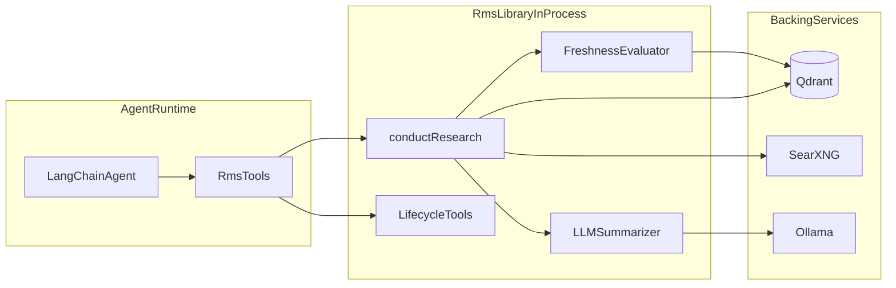
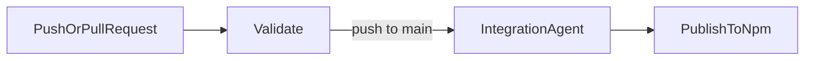

# Research Memory System built with LangChain TypeScript (RMS)

[](https://github.com/sponsors/FarukAda)


RMS is a research caching library for autonomous agents. It searches the web via SearXNG, summarizes results using an LLM, and stores condensed research in a Qdrant vector database with automatic freshness management.

## Table of Contents

- [What This Package Is](#what-this-package-is)
- [Responsibility Boundary](#responsibility-boundary)
- [System Overview](#system-overview)
- [Quick Start](#quick-start)
- [Use as Library](#use-as-library)
- [Streaming](#streaming)
- [Integration with createAgent](#integration-with-createagent)
- [Public API Reference](#public-api-reference)
- [Package Exports](#package-exports)
- [Tool Catalog](#tool-catalog)
- [Configuration Reference](#configuration-reference)
- [Production Considerations](#production-considerations)
- [Known Non-Goals](#known-non-goals)
- [Testing and CI](#testing-and-ci)
- [Documentation](#documentation)
- [Project Structure](#project-structure)
- [License](#license)

<a id="what-this-package-is"></a>

## What This Package Is

- **Research caching engine**: searches the web, summarizes, and caches results in a vector store.
- **Freshness-aware**: automatically re-fetches stale research when cached data expires.
- **LangChain-native**: exports tools via the `tool()` factory from `@langchain/core/tools`.
- **Vector-centric**: uses embeddings + Qdrant for semantic research retrieval and deduplication.

<a id="responsibility-boundary"></a>

## Responsibility Boundary

| Concern                                       | Owned by RMS | Owned by your Agent |
| --------------------------------------------- | ------------ | ------------------- |
| Web search via SearXNG                        | Yes          | No                  |
| LLM-based search result summarization         | Yes          | No                  |
| Research caching and freshness management     | Yes          | No                  |
| Research retrieval, listing, and search        | Yes          | No                  |
| Deciding when research is needed              | No           | Yes                 |
| Acting on research results                    | No           | Yes                 |

<a id="system-overview"></a>

## System Overview



<a id="quick-start"></a>

## Quick Start

### Prerequisites

- Node.js >= 22
- npm
- Docker (for Qdrant, SearXNG, and optionally Ollama)

### Install

```bash
npm add @farukada/langchain-ts-rms
```

### Development infrastructure

```bash
# Start Qdrant (vector storage) and SearXNG (web search)
docker compose up -d qdrant searxng

# Optionally start Ollama (LLM inference)
docker compose --profile ollama up -d ollama
```

Full operational steps and troubleshooting are in [docs/operations.md](./docs/operations.md).

<a id="use-as-library"></a>

## Use as Library

### Minimal registration

```ts
import { createRmsToolFromEnv } from "@farukada/langchain-ts-rms";

const researchTool = await createRmsToolFromEnv();
agent.tools.push(researchTool);
```

### Full lifecycle registration

```ts
import {
  createAllRmsToolsFromEnv,
} from "@farukada/langchain-ts-rms";

const { researchTool, lifecycleTools } = await createAllRmsToolsFromEnv();
agent.tools.push(researchTool, ...lifecycleTools);
```

### Advanced: LangChain middleware (recommended)

When registering RMS tools with a `createAgent` orchestrator, apply [LangChain 1.1 middleware](https://langchain-ai.github.io/langgraphjs/) for production-grade resilience:

```ts
import { createAgent } from "langchain";
import { toolRetryMiddleware, modelRetryMiddleware } from "langchain/middleware";
import { createAllRmsToolsFromEnv } from "@farukada/langchain-ts-rms";

const { researchTool, lifecycleTools } = await createAllRmsToolsFromEnv();

const agent = createAgent({
  model,
  tools: [researchTool, ...lifecycleTools],
  middleware: [
    toolRetryMiddleware({ maxRetries: 2 }),
    modelRetryMiddleware({ maxRetries: 2 }),
  ],
});
```

> **Note:** Middleware is applied at the _consumer-agent_ level, not inside RMS itself. RMS graph nodes already have `retryPolicy: { maxAttempts: 3 }` for internal resilience.

<a id="streaming"></a>

## Streaming

The RMS workflow supports real-time streaming via LangGraph's `streamEvents` API. Use `streamResearch()` to iterate over node transitions, LLM tokens, and state updates as they happen:

```ts
import { streamResearch, ResearchRepository, createEmbeddingProvider } from "@farukada/langchain-ts-rms";

const embeddings = createEmbeddingProvider();
const repo = new ResearchRepository({ embeddings });

for await (const event of streamResearch(
  { subject: "quantum computing breakthroughs" },
  { researchRepository: repo },
)) {
  // event.event: "on_chain_start" | "on_chain_end" | "on_llm_stream" | ...
  // event.name:  node name (e.g. "searcher", "summarizer")
  // event.data:  node input/output or token chunk
  console.log(`[${event.event}] ${event.name}`);
}
```

### Stream event types

| Event | When it fires | Useful for |
|---|---|---|
| `on_chain_start` | A graph node begins | Progress indicators |
| `on_chain_end` | A graph node completes | State snapshots |
| `on_llm_stream` | LLM emits a token | Real-time text display |
| `on_llm_end` | LLM call completes | Token usage metrics |

> **Note:** `streamResearch()` is complementary to `conductResearchDirect()`. Use `.invoke()` (via `conductResearchDirect`) when you only need the final result. Use streaming when you need real-time progress.

<a id="integration-with-createagent"></a>

## Integration with createAgent

The latest LangChain.js standard is `createAgent()` from the `langchain` package (replacing the deprecated `createReactAgent`). RMS tools integrate directly:

```ts
import { createAgent } from "langchain";
import { createAllRmsToolsFromEnv } from "@farukada/langchain-ts-rms";

const { researchTool, lifecycleTools } = await createAllRmsToolsFromEnv();

const agent = createAgent({
  model: "claude-sonnet-4-5-20250929",
  tools: [researchTool, ...lifecycleTools],
});

const result = await agent.invoke({
  messages: [{ role: "user", content: "Research the latest AI safety frameworks" }],
});
```

### Middleware hooks

`createAgent` supports lifecycle hooks for cross-cutting concerns:

| Hook | Runs | Use case |
|---|---|---|
| `before_agent` | Once before agent starts | Load user context, long-term memory |
| `before_model` | Before each LLM call | Prompt injection, context trimming |
| `after_model` | After each LLM response | Output validation, guardrails |
| `after_agent` | Once after agent completes | Analytics, cleanup |

```ts
const agent = createAgent({
  model: "claude-sonnet-4-5-20250929",
  tools: [researchTool, ...lifecycleTools],
  middleware: [
    toolRetryMiddleware({ maxRetries: 2 }),
    modelRetryMiddleware({ maxRetries: 2 }),
  ],
});
```

> **Note:** These hooks run at the _consumer-agent_ level. RMS's internal workflow uses its own retry policies and guardrails independently.

### Multi-tenancy

All tools support an optional `tenantId` field for data isolation. When set, research search, listing, and freshness evaluation are scoped to the given tenant:

```ts
const researchTool = await createRmsToolFromEnv();
// The agent passes tenantId when invoking the tool:
// { subject: "AI safety", tenantId: "org-123" }
```

Qdrant payload indexes on `metadata.tenant_id` ensure filtered queries remain fast.

<a id="public-api-reference"></a>

## Public API Reference

### Main exports

- `createResearchTool(deps)`: create the main research tool (`rms_research`).
- `createRmsToolFromEnv(options)`: env-based research tool factory.
- `createRmsLifecycleTools(deps)`: create retrieval/mutation toolset.
- `createRmsLifecycleToolsFromEnv(options)`: env-based lifecycle factory.
- `createAllRmsToolsFromEnv(options)`: convenience factory for both research + lifecycle tools with shared dependency instances (recommended).

### Key result shape (`rms_research`)

```ts
{
  version: "1.0",
  research: Research,   // { id, subject, summary, sourceUrls, tags, ... }
  source: "cache" | "web" | "cache+web",
  wasRefreshed: boolean
}
```

### Advanced dependency wiring (explicit repositories)

```ts
import {
  createResearchTool,
  ResearchRepository,
  createEmbeddingProvider,
  createChatModelProvider,
  createSearxngClient,
} from "@farukada/langchain-ts-rms";

const embeddings = createEmbeddingProvider();
const chatModel = createChatModelProvider();
const searxngClient = createSearxngClient();
const researchRepository = new ResearchRepository({ embeddings });

const researchTool = createResearchTool({
  researchRepository,
  chatModel,
  searxngClient,
  embeddings,
});
agent.tools.push(researchTool);
```

<a id="package-exports"></a>

## Package Exports

The package exposes all public APIs from the main entry point:

| Export                              | Provides                                                   |
| ----------------------------------- | ---------------------------------------------------------- |
| `createResearchTool`                | Main research tool factory                                 |
| `createRmsToolFromEnv`              | Env-driven research tool factory                           |
| `createRmsLifecycleTools`           | All lifecycle tool factories                               |
| `createRmsLifecycleToolsFromEnv`    | Env-driven lifecycle tools                                 |
| `createAllRmsToolsFromEnv`          | Both research + lifecycle, shared deps (recommended)       |
| `createGetResearchTool`             | Individual get-research tool factory                       |
| `createListResearchTool`            | Individual list-research tool factory                      |
| `createSearchResearchTool`          | Individual search-research tool factory                    |
| `createDeleteResearchTool`          | Individual delete-research tool factory                    |
| `createRefreshResearchTool`         | Individual refresh-research tool factory                   |
| `createGetDatetimeTool`             | Individual datetime tool factory                           |
| `ResearchRepository`                | Vector store repository class                              |
| `ResearchSchema`, `ResearchStatusSchema` | Zod schemas for domain validation                   |

<a id="tool-catalog"></a>

## Tool Catalog

### Research tool

- `rms_research`: Search the web, summarize results, cache in Qdrant. Returns cached results if fresh.

### Lifecycle tools

- `rms_get_research`: fetch a research entry by ID.
- `rms_list_research`: list entries with filtering and pagination.
- `rms_search_research`: semantic vector search across stored research.
- `rms_delete_research`: delete a research entry by ID.
- `rms_refresh_research`: force-refresh an existing research entry.
- `rms_get_datetime`: return current date and time information.

### Tool input/output reference

| Tool                  | Required input   | Output focus                                       |
| --------------------- | ---------------- | -------------------------------------------------- |
| `rms_research`        | `subject`        | `research`, `source`, `wasRefreshed`               |
| `rms_get_research`    | `researchId`     | Full research object                               |
| `rms_list_research`   | none             | Filtered/paginated list + `total`                  |
| `rms_search_research` | `query`          | Semantic search results with scores                |
| `rms_delete_research` | `researchId`     | Deletion confirmation                              |
| `rms_refresh_research`| `researchId`     | Refreshed research object                          |
| `rms_get_datetime`    | none             | ISO, unix, date, time, timezone, dayOfWeek         |

All tools accept **alias fields** for LLM compatibility (e.g., `topic`, `query`, `question` for `subject`; `research_id`, `id` for `researchId`).

<a id="configuration-reference"></a>

## Configuration Reference

Runtime environment variables:

| Variable                     | Required | Default                                | Purpose                                              |
| ---------------------------- | -------- | -------------------------------------- | ---------------------------------------------------- |
| `NODE_ENV`                   | No       | `development`                          | Runtime mode                                         |
| `LOG_LEVEL`                  | No       | `info`                                 | Minimum log level (`debug`, `info`, `warn`, `error`) |
| `QDRANT_URL`                 | No       | `http://localhost:6333`                | Qdrant endpoint                                      |
| `QDRANT_API_KEY`             | No       | -                                      | Qdrant authentication key                            |
| `OLLAMA_HOST`                | No       | `http://localhost:11434`               | Ollama server URL                                    |
| `OLLAMA_EMBEDDING_MODEL`     | No       | `nomic-embed-text`                     | Default embedding model                              |
| `OLLAMA_CHAT_MODEL`          | No       | `qwen3:8b`                          | Default chat/summarization model                     |
| `RMS_OLLAMA_EMBEDDING_MODEL` | No       | falls back to `OLLAMA_EMBEDDING_MODEL` | RMS-specific embedding model override                |
| `RMS_OLLAMA_CHAT_MODEL`      | No       | falls back to `OLLAMA_CHAT_MODEL`      | RMS-specific chat model override                     |
| `SEARXNG_API_BASE`           | No       | `http://localhost:8080`                | SearXNG search API endpoint                          |
| `SEARXNG_NUM_RESULTS`        | No       | `10`                                   | Default number of search results                     |
| `RMS_FRESHNESS_DAYS`         | No       | `7`                                    | Days before cached research is considered stale      |

<a id="production-considerations"></a>

## Production Considerations

- **Freshness tuning**: Adjust `RMS_FRESHNESS_DAYS` based on topic volatility.
- **SearXNG deployment**: Use a dedicated SearXNG instance with `json` format enabled.
- **Multi-tenancy**: Pass `tenantId` to isolate research per organization.
- **Qdrant sizing**: Monitor collection size and shard accordingly for large research volumes.

<a id="known-non-goals"></a>

## Known Non-Goals

- RMS does not execute actions based on research; it only provides factual summaries.
- RMS does not include citation-level provenance tracking in this package version.
- RMS does not manage user preferences or personalized search profiles.

<a id="testing-and-ci"></a>

## Testing and CI

### Local checks

| Command                 | Purpose                                |
| ----------------------- | -------------------------------------- |
| `npm test`              | Unit tests (CI-safe, no external deps) |
| `npm run test:ci`       | CI-safe unit test suite                |
| `npm run test:watch`    | Watch mode for development             |
| `npm run test:coverage` | Unit tests with V8 coverage            |

### CI pipeline



<a id="documentation"></a>

## Documentation

- [Documentation Index](./docs/README.md)
- [Architecture](./docs/architecture.md)
- [Operations Runbook](./docs/operations.md)
- [ADR 0001: RAG-Centric RMS](./docs/adr/0001-rag-centric-rms.md)

<a id="project-structure"></a>

## Project Structure

```text
src/
├── app/          # Freshness evaluation, summarization, orchestration
├── lib/          # Public library API + tools
├── config/       # Environment configuration
├── domain/       # Core contracts and research utilities
└── infra/        # Qdrant, embeddings, SearXNG, observability
```

<a id="license"></a>

## License

MIT
