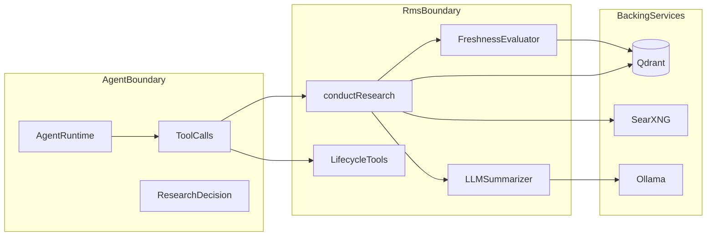
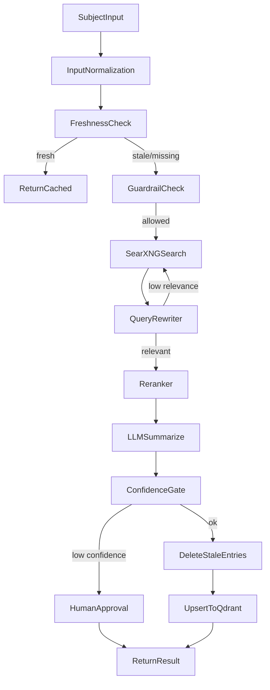
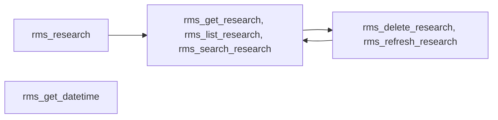

# RAG-Centric RMS Architecture

## Overview

The Research Memory System (RMS) is a RAG-centric architecture for caching and retrieving web research for autonomous agents. Research entries are embedded and stored in Qdrant, enabling semantic search, automatic freshness management, and LLM-based summarization of web search results.

## Scope Boundary

> **⚠️ Research Library Only** — RMS searches the web, summarizes results, and caches them. It does **not** decide when research is needed or act on the results. Your agent runtime is responsible for invoking research tools and using the findings.

- RMS **searches, summarizes, and caches** research.
- External agents **decide** what to research and **act** on results.

## Core Components

### 1. Research Orchestrator

The core flow produces cached, summarized research:

- **Freshness Evaluator**: Checks Qdrant for existing research on the subject, evaluates expiration
- **SearXNG Client**: Searches the web when cached data is stale or missing
- **LLM Summarizer**: Condenses raw search results into a concise summary with confidence score, tags, and language
- **Qdrant Repository**: Stores and retrieves research entries as embedded vectors

### 2. Qdrant as Vector Backbone

- **Collection**: `rms_research` (single collection for all research entries)
- **Filterable HNSW**: Semantic search with strict payload filters (status, tenant, tags)
- **Payload indexing**: Enables fast metadata filtering for freshness checks and listing

### 3. Research Freshness Model

1. **Subject embedding**: User query → vector
2. **Cache lookup**: Similarity search in Qdrant for existing research on the subject
3. **Freshness check**: Compare `expiresAt` timestamp against current time
4. **Decision**: If fresh → return cached. If stale/missing → search web → summarize → cache
5. **Stale cleanup**: Delete old entries when refreshed to prevent accumulation

### 4. Research Lifecycle Tooling

The library exposes one research tool and a full lifecycle toolset:

- Research: `rms_research`
- Retrieval: `rms_get_research`, `rms_list_research`, `rms_search_research`
- Mutation: `rms_delete_research`, `rms_refresh_research`
- Utility: `rms_get_datetime`

## Data Flow

## Lifecycle Tool Map

## Domain Invariants

RMS enforces the following invariants:

- Research entries have unique IDs (UUID v4).
- `confidenceScore` is always in the `[0, 1]` range.
- `expiresAt` is computed from `updatedAt + freshnessDays`.
- `status` follows the enum: `active`, `stale`, `refreshing`, `archived`, `low_confidence`.
- All tool outputs include a `version: "1.0"` field for contract stability.

## Quality Guarantees

- **Type safety**: Strict TypeScript with `exactOptionalPropertyTypes`, Zod runtime validation
- **Response contracts**: Versioned tool outputs (`version` field)
- **LLM compatibility**: Alias fields, lax type coercion for string-typed inputs
- **Observability**: Structured JSON logging, trace correlation, node timing instrumentation

## Environment Configuration

`config/env.ts` loads and validates environment variables using Zod schemas. Configuration is cached on first load, with `resetEnv()` available for test isolation. Supported providers:

- **Ollama**: `OLLAMA_HOST` for model inference (with optional `RMS_OLLAMA_*` overrides)
- **Qdrant**: `QDRANT_URL` and optional `QDRANT_API_KEY`
- **SearXNG**: `SEARXNG_API_BASE` for web search

| Variable | Default | Description |
|---|---|---|
| `RMS_OLLAMA_NUM_CTX` | 8192 | Ollama context window size |
| `SEARXNG_ENGINES` | (all) | Comma-separated engine list |
| `SEARXNG_LANGUAGE` | (auto) | ISO language code for search |
| `SEARXNG_TIME_RANGE` | (none) | Time range filter (e.g. "month") |
| `RMS_FRESHNESS_DAYS` | 7 | Cache expiration in days |

## Observability

`infra/observability/tracing.ts` provides structured logging and timing instrumentation:

- **Log levels**: `logInfo`, `logWarn`, `logError`, `logDebug` — structured JSON with `level`, `msg`, and ISO timestamp
- **Timing**: `withNodeTiming(name, traceId, researchId, fn)` wraps async operations with duration measurement
- **Trace correlation**: log entries include optional `traceId` for request tracing
- **Error codes**: `ErrorCodes` enum for RMS-specific error classification

## Agentic RAG Extensions

### Query Rewriting Loop
- After each search, `queryRewriterNode` evaluates result relevance via LLM
- If relevance < 0.4 and rewrite count < 2 (`MAX_REWRITES`), rewrites query and loops back to `searcher`
- Graceful degradation: on LLM failure, assumes relevance to avoid infinite loops

### Re-ranking
- Embeds subject + all result snippets using the configured embedding model
- Cosine similarity scoring; filters below `minScore` (default 0.3), returns top-N

### Confidence Gating
- After summarization, if confidence < 0.4, routes to `human_approval` for review

### Error Recovery (Degraded Mode)
- **Searcher**: returns empty results + error on failure instead of throwing
- **Summarizer**: falls back to raw snippet concatenation with confidence 0.1

### Hybrid Retrieval
- Primary: semantic vector similarity via Qdrant
- Fallback: if semantic score < 0.5, re-searches and takes the higher-scoring result
