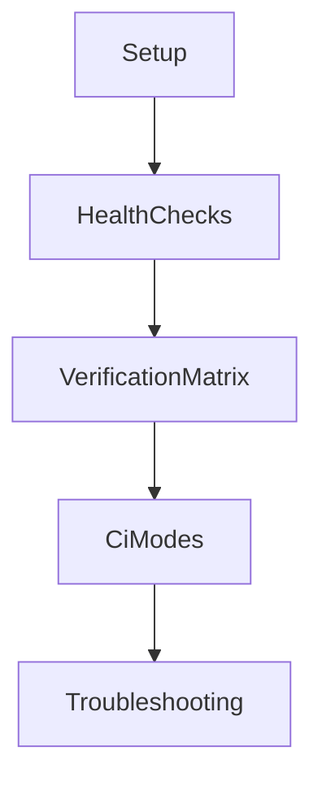
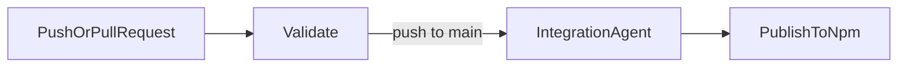

# RMS Operations Runbook

## Purpose

This runbook explains how to run, verify, and troubleshoot the RMS package in local and CI environments.

## Runbook Map



## Local Development

### Prerequisites

- Node.js >= 22
- npm
- Docker (for Qdrant and SearXNG)

### Quick Start

```bash
# 1. Install dependencies
npm install --legacy-peer-deps

# 2. Configure environment
cp .env.example .env

# 3. Start Qdrant, SearXNG, and optionally Ollama
docker compose up -d qdrant searxng
docker compose --profile ollama up -d ollama
```

### Minimal Environment Variables

- `QDRANT_URL` (default: `http://localhost:6333`)
- `OLLAMA_HOST` (default: `http://localhost:11434`)
- `SEARXNG_API_BASE` (default: `http://localhost:8080`)

### Full Environment Reference

| Variable                     | Required | Default                                | Notes                                  |
| ---------------------------- | -------- | -------------------------------------- | -------------------------------------- |
| `NODE_ENV`                   | No       | `development`                          | `development`, `test`, or `production` |
| `LOG_LEVEL`                  | No       | `info`                                 | `debug`, `info`, `warn`, or `error`    |
| `QDRANT_URL`                 | No       | `http://localhost:6333`                | Qdrant endpoint                        |
| `QDRANT_API_KEY`             | No       | -                                      | Needed when Qdrant auth is enabled     |
| `OLLAMA_HOST`                | No       | `http://localhost:11434`               | Ollama server URL                      |
| `OLLAMA_EMBEDDING_MODEL`     | No       | `nomic-embed-text`                     | Default embedding model                |
| `OLLAMA_CHAT_MODEL`          | No       | `qwen3:8b`                          | Default chat model                     |
| `RMS_OLLAMA_EMBEDDING_MODEL` | No       | falls back to `OLLAMA_EMBEDDING_MODEL` | RMS-specific embedding override        |
| `RMS_OLLAMA_CHAT_MODEL`      | No       | falls back to `OLLAMA_CHAT_MODEL`      | RMS-specific chat model override       |
| `SEARXNG_API_BASE`           | No       | `http://localhost:8080`                | SearXNG API endpoint                   |
| `SEARXNG_NUM_RESULTS`        | No       | `10`                                   | Default search result count            |
| `RMS_FRESHNESS_DAYS`         | No       | `7`                                    | Days before research is stale          |

## Qdrant Collection Schema

RMS uses one Qdrant collection, auto-created on bootstrap:

| Collection       | Purpose                                                 |
| ---------------- | ------------------------------------------------------- |
| `rms_research`   | Stores research embeddings and metadata                 |

**Vector configuration:** Cosine distance, vector size determined by the configured embedding model (e.g., 768 for `nomic-embed-text`).

**Payload indices** (keyword, created automatically):

| Index Field               | Purpose                         |
| ------------------------- | ------------------------------- |
| `metadata.status`         | Filter research by status       |
| `metadata.tenant_id`      | Multi-tenancy isolation         |
| `metadata.subject`        | Subject-based lookup            |
| `metadata.language`       | Language filtering              |

## Verification Matrix

- **Unit tests** (no external deps): `npm run test:ci`
- **All tests**: `npm test`
- **Watch mode**: `npm run test:watch`
- **Coverage**: `npm run test:coverage`
- **Agent integration** (requires Qdrant + Ollama + SearXNG): `npm run test:agent`

### Functional Coverage Checklist

Use this checklist before release:

- [ ] Research flow (`rms_research`) returns summarized research + `source` indicator
- [ ] Freshness check correctly returns cached data when fresh
- [ ] Stale/missing research triggers SearXNG search and LLM summarization
- [ ] Retrieval tools return expected entities (`rms_get_research`, `rms_list_research`, `rms_search_research`)
- [ ] Mutation tools work correctly (`rms_delete_research`, `rms_refresh_research`)
- [ ] Unit test suite passes
- [ ] Agent integration test passes in real tool-calling mode

### CI Workflow View



### Running Tests Locally

```bash
docker compose up -d qdrant searxng
npm test
```

## GitHub Actions Pipeline

All stages live in a single `ci.yml` workflow:

- **Stage 1 — Validate** (all pushes + PRs): `typecheck`, `lint`, `format:check`, `build`, `test:ci`, `npm audit`.
- **Stage 2 — Integration Agent** (main only, after validate): boots Qdrant + Ollama + SearXNG, runs `test:agent`.
- **Stage 3 — Publish** (main only, after integration): builds and publishes to npm with provenance.

Notes:

- Integration stage duration depends on Ollama model pull time and SearXNG startup.
- Integration stage has startup health checks, retries, and failure log dumps.
- Publish reads the version directly from `package.json`.

## Troubleshooting

Common issues and fixes:

- **Qdrant unreachable**: verify container is running and `QDRANT_URL` matches the mapped port.
- **SearXNG returning errors**: verify container is running and `settings.yml` has `format: json` set.
- **Empty or low-quality summaries**: check Ollama model and token limits; ensure search results are being returned.
- **Agent test skipped/failing**: verify Ollama process is healthy and required models are present.

## Documentation Hygiene Checklist

- Keep examples copy-pasteable and environment-aware.
- Keep tool names consistent with `src/lib/rmsTool.ts`.
- Keep architecture boundaries aligned with `docs/architecture.md`.
- Update this runbook when scripts or workflow names change.

## Related Documentation

- [Architecture](architecture.md)
- [ADR 0001](adr/0001-rag-centric-rms.md)
